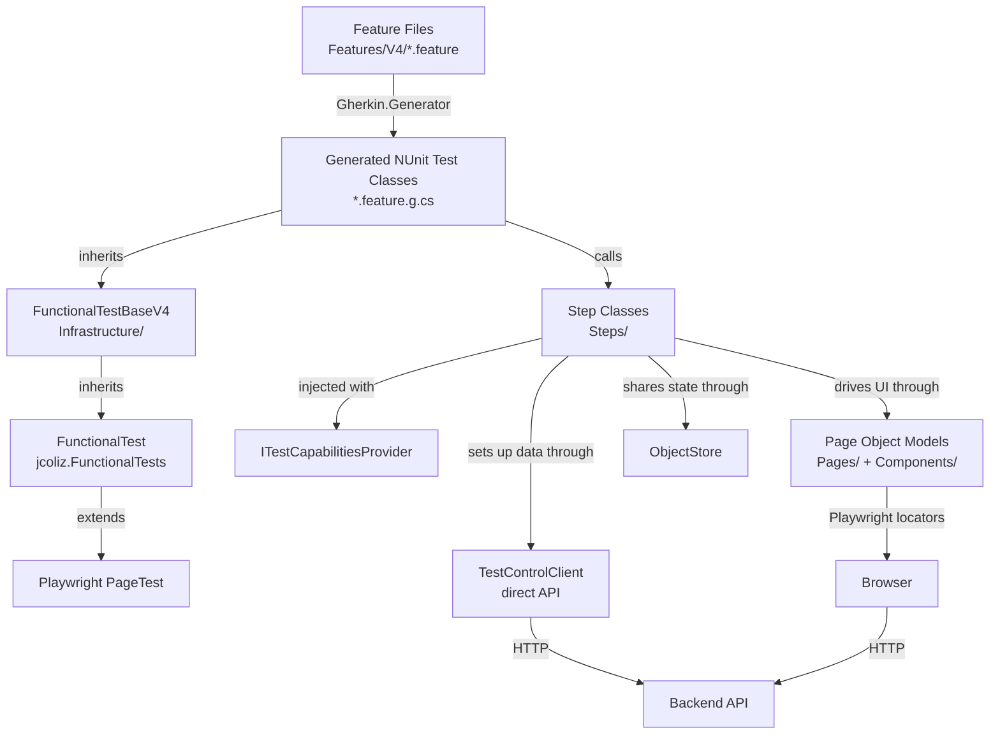
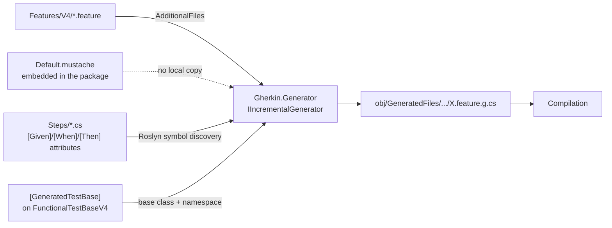

# System Architecture

This document explains how the functional test system is put together: the layers it is built
from, the technologies involved, how `.feature` files become executable NUnit tests, and what
happens during a single test run.

Read this first. Everything else in [the docs folder](./) assumes the mental model described here.

## Contents

- [Layer Diagram](#layer-diagram)
- [Technology Stack](#technology-stack)
- [Code Generation Pipeline](#code-generation-pipeline)
- [Base Library: jcoliz.FunctionalTests](#base-library-jcolizfunctionaltests)
- [Infrastructure Layer](#infrastructure-layer)
- [Data Flow: A Test Execution](#data-flow-a-test-execution)
- [Design Principles](#design-principles)

## Layer Diagram

The system is layered so that each concern lives in exactly one place. Feature files describe
*what* the user does, step classes describe *how* a business action is performed, and page
objects describe *where* the controls are and *when* the page is ready.



The critical asymmetry: **setup goes through the API, verification goes through the browser.**
Arranging data via [`TestControlClient`](../Infrastructure/TestControlClient.cs) is fast and
deterministic; exercising and asserting via Playwright verifies the actual user path.

## Technology Stack

| Component | Version | Role |
| --- | --- | --- |
| [Gherkin.Generator](https://www.nuget.org/packages/Gherkin.Generator) | 0.1.11 | Roslyn incremental source generator that turns `.feature` files into NUnit test classes. Ships its own Mustache output template and the `[Given]`/`[When]`/`[Then]`/`[GeneratedTestBase]` attributes. |
| [Microsoft.Playwright.NUnit](https://playwright.dev/dotnet/) | 1.61.0 | Browser automation; provides the `PageTest` base class and per-test browser context |
| NUnit | 4.6.1 | Test framework: attributes, assertions, test parameters, lifecycle |
| NUnit3TestAdapter | 6.2.0 | VSTest adapter, enables `dotnet test` and IDE test explorer |
| Microsoft.NET.Test.Sdk | 18.8.1 | Test host and `.runsettings` support |
| YamlDotNet | 18.1.0 | Reading YAML sample data and test models |
| NUnit.Analyzers | 4.14.0 | Compile-time checks on assertion usage |
| `jcoliz.FunctionalTests` | submodule | Shared base library (see [below](#base-library-jcolizfunctionaltests)) |
| `FakeObjects` | submodule | Test data generation helpers |

All package and project references are declared in
[ListsWebApp.Tests.Functional.csproj](../ListsWebApp.Tests.Functional.csproj).

## Code Generation Pipeline

No test method in this project is written by hand. Every `[Test]` is generated at compile time
from a Gherkin scenario.



The generator is an `IIncrementalGenerator`. It builds its output from four inputs: the `.feature`
files handed to it as `AdditionalFiles`, the step-attributed methods it finds in the compilation,
the `[GeneratedTestBase]`-decorated class, and a Mustache template that ships inside the package.

### 1. Feature files are declared as generator input

The generator only sees files that MSBuild hands it as `AdditionalFiles`:

```xml
<!-- Generated tests -->
<ItemGroup>
  <AdditionalFiles Include="Features\V4\*.feature" />
</ItemGroup>
```

This is why a `.feature` file placed anywhere other than `Features/V4/` produces no tests. Files
under [Features/](../Features/) but outside `V4/` (such as the `*TODO.feature` files) are
deliberately excluded — they are parking lots for scenarios not yet ported.

### 2. The base class opts in via attribute

[`FunctionalTestBaseV4`](../Infrastructure/FunctionalTestBase.cs) is decorated with:

```csharp
[GeneratedTestBase(UseNamespace = "ListsWebApp.Tests.Functional.Features")]
public abstract class FunctionalTestBaseV4 : FunctionalTest, ITestCapabilitiesProvider
```

This tells the generator two things: which class every generated test class should inherit from,
and which namespace to emit into. There is exactly one such attribute in the project, so all
generated tests share one base.

### 3. Step attributes are matched against step text

The generator scans every syntax tree in the compilation for methods carrying `[Given]`, `[When]`
or `[Then]` — the classes in [Steps/](../Steps/). Those attributes are defined by the generator
package itself, in the `Gherkin.Generator.Utils` namespace, and all three allow multiple
applications so one method can bind several step phrasings.

For each step line in a scenario, the generator converts the attribute's `{placeholder}` pattern
into a regular expression, matches it against the step text, and emits the captured values as C#
literal arguments typed from the method's own signature. Scenario Outline `<placeholders>` are
handled separately: they become `string` parameters on the generated test method, supplied by
`[TestCase]` attributes.

If **no** binding matches, the generator does not fail the build. Instead it does three things:

1. Emits a stub into the generated class:

   ```csharp
   /// <summary>
   /// Given some step nobody has implemented yet
   /// </summary>
   [Given("some step nobody has implemented yet")]
   public async Task GivenSomeStepNobodyHasImplementedYet()
   {
       throw new NotImplementedException();
   }
   ```

   The stub's method name and parameters are inferred from the raw step text — quoted strings
   become `string` parameters, bare integers become `int` parameters — so it is usually
   copy-pasteable straight into the right step class.

2. Marks the containing scenario `[Explicit("steps_in_progress")]`, so an incomplete scenario
   cannot fail an unattended run.

3. Emits build warning **GHERKIN004**, naming the feature and the count of unimplemented steps.

This is a deliberate and valuable property of the pipeline: **you can write all your scenarios
first, build, and immediately see exactly which steps are missing** — without paying for a full
browser test run.

### 4. The output shape is fixed by the generator's embedded template

The Mustache template that shapes the generated C# is **embedded in the Gherkin.Generator
package** (as the resource `Gherkin.Generator.Templates.Default.mustache`). There is no template
file in this project, and none is needed. The header of every generated file records which
template produced it:

```csharp
// ------------------------------------------------------------
//  <auto-generated>
//      This code was generated by Gherkin.Generator
//      Using template: Default.mustache (embedded)
// ------------------------------------------------------------
```

> **Overriding the template.** The generator will use a custom template if one is supplied — it
> takes the *first* `.mustache` file it finds in `AdditionalFiles`, falling back to the embedded
> resource when there is none. **This project deliberately does not override it.** Staying on the
> stock template means generator upgrades bring improved output for free; a local copy would
> silently freeze the output shape at whatever version it was forked from. Only add a
> `<AdditionalFiles Include="...mustache" />` entry if the default genuinely cannot express what
> is needed.

The template's notable behaviours:

| Gherkin construct | Generated C# |
| --- | --- |
| `Feature:` name + description | Class `<FileName>_Feature_Tests` with XML doc comments |
| `Background:` | A `[SetUp]` method named `SetupAsync()` |
| `Rule:` | A `#region Rule: <name>` grouping |
| `Scenario:` | A `[Test] public async Task` method |
| `Scenario Outline:` + `Examples:` | One `[TestCase(...)]` attribute per example row, plus a `string` parameter per column |
| Step line | An inline `// Keyword Text` comment plus `await <StepClass>.<Method>(args);` |
| Data table | A local `DataTable` variable passed to the step method |
| Unmatched step | A `[Given/When/Then]` stub throwing `NotImplementedException` in a `#region Stubs for Unimplemented Steps` |
| Step classes used | Lazily-constructed properties: `protected NavigationSteps NavigationSteps => _theNavigationSteps ??= new(this);` |

Because step classes are constructed with `this` — the test instance — every step class receives
the live [`ITestCapabilitiesProvider`](../Infrastructure/FunctionalTestBase.cs) for the current
test.

### 5. Tags control test attributes and generation

Tags are the only mechanism for influencing generation from inside a `.feature` file.

**Scenario-level:**

| Tag | Effect |
| --- | --- |
| `@explicit` | `[Explicit]` — excluded from unattended runs, runnable by name or `--filter` |
| `@explicit:<reason>` | `[Explicit("<reason>")]`, e.g. `@explicit:not-implemented` |
| `@category:<name>` | `[Category("<name>")]`; may be repeated |
| `@order:<n>` | `[Order(<n>)]` |
| `@hidden` | Scenario is skipped entirely — no code generated |

**Feature-level:**

| Tag | Effect |
| --- | --- |
| `@namespace:<ns>` | Overrides the namespace for this feature's generated class |
| `@baseclass:<type>` | Overrides the base class for this feature's generated class |
| `@using:<ns>` | Adds a `using` directive to the generated file |

The feature-level tags exist for projects with more than one test base. This project has exactly
one — [`FunctionalTestBaseV4`](../Infrastructure/FunctionalTestBase.cs) — so these tags should not
appear in `Features/V4/`.

Tags this project uses that the generator ignores, such as `@ab:NNNN` for work-item linkage, are
purely documentary. See [writing-features.md](./writing-features.md).

### 6. Build diagnostics

| ID | Level | Meaning |
| --- | --- | --- |
| `GHERKIN001` | Error | The Mustache template could not be loaded |
| `GHERKIN002` | Error | Unhandled exception while processing a feature |
| `GHERKIN003` | Error | Gherkin parse error — malformed `.feature` syntax |
| `GHERKIN004` | Warning | A feature has unimplemented steps; stubs were generated |

`GHERKIN004` is the one you will see routinely, and it is the primary feedback loop when building
out a new feature. Everything else indicates a broken input.

### 7. Inspecting the generated code

The project keeps generated files on disk so you can read them:

```xml
<EmitCompilerGeneratedFiles>true</EmitCompilerGeneratedFiles>
<CompilerGeneratedFilesOutputPath>$(BaseIntermediateOutputPath)\GeneratedFiles</CompilerGeneratedFilesOutputPath>
```

After a build, look in `obj/GeneratedFiles/Gherkin.Generator/Gherkin.Generator.GherkinSourceGenerator/`
for one `<Feature>.feature.g.cs` per feature file. When a scenario behaves unexpectedly, reading
the generated method is usually the fastest way to see which step binding actually got selected.

Here is the first scenario of [Views.feature](../Features/V4/Views.feature) as generated, showing
the `Background` `[SetUp]`, the Scenario Outline expansion, and the step-class properties:

```csharp
public partial class Views_Feature_Tests : FunctionalTestBaseV4
{
    /// <summary>
    /// Background Setup
    /// </summary>
    [SetUp]
    public async Task SetupAsync()
    {
        // Given user has logged in
        await AuthenticationSteps.UserIsLoggedInWithThatAccount();

        // And test mode has started
        await TestControlSteps.TestModeHasStarted();
    }

    #region Rule: Display items

    /// <summary>
    /// Empty page shows no items
    /// </summary>
    [TestCase("Browse")]
    [TestCase("Prepare")]
    [TestCase("Shop")]
    [TestCase("Manage")]
    [Test]
    public async Task EmptyPageShowsNoItems(string View)
    {
        // Given no existing items
        await BrowseSteps.NoExistingItems();

        // When user visits the <View> page
        await NavigationSteps.UserNavigatesToAnyPage(View);

        // Then Results has 0 body rows
        await ItemSteps.ResultsHasBodyRows(0);
    }

    #endregion

    #region Step class references

    protected BrowseSteps BrowseSteps => _theBrowseSteps ??= new(this);
    protected NavigationSteps NavigationSteps => _theNavigationSteps ??= new(this);

    private BrowseSteps? _theBrowseSteps;
    private NavigationSteps? _theNavigationSteps;

    #endregion
}
```

Note how little indirection there is: the generated test calls step methods directly, with no
reflection and no runtime binding step. What you read is what runs.

## Base Library: jcoliz.FunctionalTests

The [`jcoliz.FunctionalTests`](../../../submodules/jcoliz.FunctionalTests/src/FunctionalTests)
submodule holds everything that is *not* specific to this application. Keeping it separate is what
forces the app-specific layers to stay thin.

| Type | Responsibility |
| --- | --- |
| [`FunctionalTest`](../../../submodules/jcoliz.FunctionalTests/src/FunctionalTests/FunctionalTest.cs) | Base test class extending Playwright's `PageTest`. Owns the browser context options, test parameters, `HttpClient`, `ObjectStore`, cleanup registry, and screenshot-on-failure. |
| [`IBaseStepCapabilities`](../../../submodules/jcoliz.FunctionalTests/src/FunctionalTests/IBaseStepCapabilities.cs) | The narrow surface step classes are allowed to use: `Page`, `ObjectStore`, `GetOrCreatePage<T>()`, `AddCleanupAction()`, `TargetEnvironment`. |
| [`ObjectStore`](../../../submodules/jcoliz.FunctionalTests/src/FunctionalTests/ObjectStore.cs) | Keyed dictionary for passing state between steps within one test. |
| [`PageObjectModel`](../../../submodules/jcoliz.FunctionalTests/src/FunctionalTests/PageObjectModel.cs) | Base for all page objects: `LaunchSite()`, `ReloadPageAsync()`, `IsAvailableAsync()`, `WaitForEnabled()`, `WaitForApi()`, `SaveScreenshotAsync()`. |
| [`TestCorrelationContext`](../../../submodules/jcoliz.FunctionalTests/src/FunctionalTests/TestCorrelationContext.cs) | W3C trace context for the test, so server-side logs can be tied back to the test that produced them. |
| [`BuiltInSteps`](../../../submodules/jcoliz.FunctionalTests/src/FunctionalTests/BuiltInSteps.cs) | Generic, app-agnostic step definitions available to every feature. |

### Test lifecycle provided by `FunctionalTest`

- **`ContextOptions()`** — selects the browser viewport from the optional `viewportSize`
  parameter: `xs` (390×844, iPhone), `md` (768×1024, iPad), `lg` (1024×768, iPad landscape) and
  `xl` (1368×912, Surface Pro, the default). Responsive behaviour is therefore testable without
  changing test code.
- **`[SetUp] SetUpBase()`** — creates the `ObjectStore`, applies `defaultTimeout`, opens a
  `TestCorrelationContext`, and attaches correlation headers/cookie to both the browser context
  and the `HttpClient`.
- **`[TearDown] TearDownBase()`** — runs registered cleanup actions, saves a screenshot when the
  test failed, and disposes the `HttpClient` and correlation activity.

NUnit runs base-class `[SetUp]` methods before derived ones, so `SetUpBase()` always completes
before [`FunctionalTestBaseV4.SetUp()`](../Infrastructure/FunctionalTestBase.cs), which in turn
completes before the generated `SetupAsync()` that runs the feature's `Background`.

### Configuration and secrets

Parameters come from `.runsettings` files, read through `GetRequiredParameter()`. Values may
contain `{ENV_VAR}` references, which `ResolveEnvironmentVariables()` substitutes from process
environment variables or a `.env` file discovered near the test assembly. This keeps credentials
out of source control while allowing the same runsettings shape across environments. See
[environments.md](./environments.md) for the full parameter list.

### Cross-test correlation

Each test opens a `TestCorrelationContext` that produces a `traceparent` header plus
`X-Test-Name`, `X-Test-Id`, `X-Test-Class` and `X-Test-Client`. These flow on both Playwright
browser requests and `TestControlClient` requests, so a failing test can be traced through the
server's logs.

## Infrastructure Layer

The [Infrastructure/](../Infrastructure/) folder is the seam between the shared base library and
this application.

### `ITestCapabilitiesProvider`

```csharp
public interface ITestCapabilitiesProvider : IBaseStepCapabilities
{
    TestControlClient TestControlClient { get; }
}
```

Step classes take this interface — not the concrete test class — in their constructor:

```csharp
public class TestControlSteps(ITestCapabilitiesProvider context)
```

The interface is intentionally minimal. It adds exactly one member to the base capabilities: the
test control client. Step classes therefore cannot reach into NUnit internals or the test class
itself, which keeps them portable and independently reasonable.

### `FunctionalTestBaseV4`

[`FunctionalTestBaseV4`](../Infrastructure/FunctionalTestBase.cs) is the generated tests' base
class. Its `[SetUp]` does three things:

1. Stores a `"Tester"` user in the `ObjectStore` — the pre-seeded account with the *Functional
   Test* role. This is kept as an unchanging fallback so a test that swaps identities cannot
   permanently lock the suite out of the site.
2. Stores a `"DefaultUser"` — the account tests actually log in with. Tests are free to replace
   this (for example after creating a `__TEST__` user).
3. Constructs the `TestControlClient` from the inherited `HttpClient` and the `userName` /
   `userPassword` parameters.

### `TestControlClient`

[`TestControlClient`](../Infrastructure/TestControlClient.cs) talks to the backend's test control
endpoints directly over HTTP. It authenticates lazily on first use against `/api/auth/login`,
extracts the tenant GUID from the returned entitlement claims, and caches the bearer token for the
remainder of the test.

| Method | Request | Purpose |
| --- | --- | --- |
| `BeginAsync(Guid? withList)` | `POST /api/tenant/{list}/Test/begin` | Enter test mode: clear items, delete `__TEST__` users |
| `SeedAsync()` | `POST /api/tenant/{tenant}/Test/seed` | Load demo data |
| `UploadItemsAsync(string filename, Guid? toList)` | `POST /api/tenant/{list}/Items/items` | Upload a YAML file from `SampleData/` as multipart form data |
| `CreateInvitationAsync(...)` | `PUT /api/tenant/{tenant}/Test/invite` | Create an invitation, returns its code |
| `CreateUserAsync(string[]? actions)` | `POST /api/tenant/{tenant}/Test/user` | Create a `__TEST__` user with given entitlements |
| `GetNotificationsAsync(string userName)` | `GET /api/tenant/{tenant}/Test/notifications` | Read password-reset / email-confirmation codes |

This is the single biggest lever on suite speed. Arranging a precondition through the API costs one
HTTP round trip; arranging the same precondition through the UI costs a page load, several
interactions, and their associated waits.

### Presentation layer: pages and components

[Pages/](../Pages/) contains one page object per application page, arranged in a shallow hierarchy
rooted at `PageObjectModel` → `BasePage` → `ItemsViewBasePage` → `ViewsPage` / `ManagePage`.
[Components/](../Components/) contains reusable fragments such as `ItemEditDialog` and
`BaseInputTextIdentity` that compose into pages.

Three rules govern this layer (see [writing-pages.md](./writing-pages.md) for detail):

1. **Locators are defined only in page objects.** No step class and no feature file contains a
   selector.
2. **Each locator is defined once.** When a `data-test-id` changes, exactly one line changes.
3. **All waiting lives in page objects.** Steps never sleep and never poll.

### Sample data

[SampleData/](../SampleData/) holds YAML fixtures copied to the output directory by `Content`
items in the `.csproj`. `TestControlClient.UploadItemsAsync("ThreeItems")` resolves
`SampleData/ThreeItems.yaml` next to the test assembly and posts it. See
[sample-data.md](./sample-data.md).

## Data Flow: A Test Execution

The sequence below traces a representative scenario from
[Views.feature](../Features/V4/Views.feature) end to end.

```mermaid
sequenceDiagram
    autonumber
    participant NUnit
    participant Base as FunctionalTest / FunctionalTestBaseV4
    participant Test as Generated Test Class
    participant Steps as Step Classes
    participant POM as Page Objects
    participant API as TestControlClient
    participant Browser as Playwright Browser
    participant Server as App Server

    NUnit->>Base: SetUpBase — ObjectStore, timeout, correlation context
    NUnit->>Base: SetUp — load Tester/DefaultUser, build TestControlClient
    NUnit->>Test: SetupAsync — Background steps
    Test->>Steps: Given user has logged in
    Steps->>POM: LoginPage.SignIn
    POM->>Browser: fill + click, WaitForApi
    Browser->>Server: POST /api/auth/login
    Test->>Steps: Given test mode has started
    Steps->>API: BeginAsync
    API->>Server: POST /api/tenant/{id}/Test/begin

    NUnit->>Test: Scenario method
    Test->>Steps: Given one existing item
    Steps->>API: UploadItemsAsync("OneItem")
    API->>Server: POST /api/tenant/{id}/Items/items
    Steps->>Base: AddCleanupAction — clear list afterward

    Test->>Steps: When user visits the Browse page
    Steps->>Base: GetOrCreatePage&lt;ViewsPage&gt;
    Steps->>POM: NavigateToUrlAsync
    POM->>Browser: GotoAsync + WaitForPageReadyAsync
    Browser->>Server: GET /browse + GET /api/.../Items
    Steps->>Base: ObjectStore.Add("CurrentPage", page)

    Test->>Steps: Then Results contains "Name 01"
    Steps->>Base: ObjectStore.Get&lt;ItemsViewBasePage&gt;
    Steps->>POM: ItemNames.AllTextContentsAsync
    POM->>Browser: locator query
    Steps-->>NUnit: Assert

    NUnit->>Base: TearDownBase — cleanup actions, screenshot on failure, dispose
```

### Where state lives

State crosses step boundaries through the `ObjectStore`, never through fields on step classes
(step classes are constructed lazily per test and must not be assumed to be shared).

The generator's shared-state analysis follows the explicit annotations on the step methods and
generated test base. `ObjectStore` is the runtime transport, but `[Requires]`, `[Provides]`, and
`[BaseProvides]` are the contract the generator reads.

| Key | Written by | Read by |
| --- | --- | --- |
| `Tester` | `FunctionalTestBaseV4.SetUp` | Authentication steps needing guaranteed access |
| `DefaultUser` | `FunctionalTestBaseV4.SetUp`, `TestControlSteps.CreateTestAccount` | Login, invitation and password steps |
| `CurrentPage` | `NavigationSteps.UserNavigatesToAnyPage` | Page assertion steps |
| `ItemsViewBasePage` | `NavigationSteps` when navigating to an items view | Shared search / results / edit steps |
| `InvitationCode` | `TestControlSteps.AnInvitationHasBeenCreated` | Registration steps |
| `ResetCode` | `TestControlSteps.UserIsSentAResetLink` | Password reset steps |

By convention, step methods still explain state flow in prose comments, but the attributes are the
contract the generator uses for shared-state warnings and generated commentary — see
[writing-steps.md](./writing-steps.md).

### Page object caching

`GetOrCreatePage<T>()` looks up `T` in the `ObjectStore` by type name, constructing and storing it
on first request. Within a test, every step therefore sees the same page object instance, which
lets page objects hold state such as a cached dialog component.

### Cleanup

Steps register teardown work with `AddCleanupAction(key, action)`. The key makes registration
idempotent: a scenario that seeds data three times still cleans up once. `TearDownBase()` runs all
registered actions after the test, before disposing the HTTP client.

## Design Principles

These are the rules that keep additions small. Violating them is what makes a functional suite
slow and brittle.

1. **Arrange through the API, act and assert through the browser.** Only the behaviour under test
   should be exercised through the UI.

2. **A page-object action must wait for the user-visible operation to settle, not merely for the
   initiating API response.** A command that triggers a refresh must await both the command *and*
   the resulting render/ready state. This is the single most common source of flaky tests, and the
   fix always belongs in the page object — never a sleep in a step or a retry in a feature file.

3. **Prefer semantic test IDs over locator chains.** Use `GetByTestId()` against a stable
   `data-test-id` rather than `.First`, `.Last`, `:nth-child`, or parent traversal. When new UI is
   needed, add the test ID to the application as part of the same change.

4. **Write all scenarios first, tag them `@explicit:wip`, then implement.** Author the complete set
   of scenarios, build, and read the `GHERKIN004` warning and the generated
   `NotImplementedException` stubs to discover exactly which steps are missing. Run scenarios
   individually with `--filter` as they come online, and **remove each `@explicit:wip` tag only once
   you have watched that scenario pass.**

   Two separate mechanisms produce `[Explicit]` here, and they are not interchangeable. The
   generator adds `[Explicit("steps_in_progress")]` to any scenario with an unimplemented step and
   removes it automatically once the last step is implemented — that protects against a scenario
   throwing `NotImplementedException`. The hand-applied `@explicit:wip` tag protects against
   something the generator cannot see: a scenario that now compiles and runs but has never been
   observed to pass. Without it, a scenario joins the unattended run the instant its final step is
   implemented, which is exactly when it is least likely to be correct. Only the test author can
   retire that tag, because only the test author has seen the green result.

   The same generator pass now also uses `[Requires]`, `[Provides]`, and `[BaseProvides]` to make
   shared-state flow visible in the generated test body and to warn when a step depends on state
   that has not been established earlier in the scenario.

5. **Keep Gherkin wording reusable but not artificially generic.** Scenario-specific phrasing is
   correct when it encodes meaningful domain setup; over-generalising step text produces steps with
   many parameters and unclear intent.

6. **Step classes depend on `ITestCapabilitiesProvider`, not on the test class.** If a step needs a
   new capability, add it to the interface deliberately rather than casting.

## Where to Next

| Goal | Document |
| --- | --- |
| Run tests against an environment | [environments.md](./environments.md) |
| Debug a scenario that won't pass | [debugging.md](./debugging.md) |
| Write a new `.feature` file | [writing-features.md](./writing-features.md) |
| Implement a step binding | [writing-steps.md](./writing-steps.md) |
| Add or change a page object | [writing-pages.md](./writing-pages.md) |
| Find an existing step to reuse | The generated step catalog at `bin/Debug/net10.0/ListsWebApp.Tests.Functional.StepCatalog.md` after a test run |
| Add a YAML fixture | [sample-data.md](./sample-data.md) |
