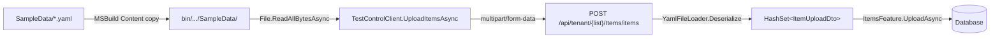

# Sample Data Files

Functional tests need deterministic starting data. Creating it through the UI would be slow and
would test the create path in every scenario that merely needs an item to exist. Instead, `Given`
steps push YAML fixtures straight into the backend through the items upload endpoint.

This guide covers the format, what the fixtures can and cannot express, and how to add one.

## Contents

- [How Sample Data Works](#how-sample-data-works)
- [File Location and Build Setup](#file-location-and-build-setup)
- [The YAML Schema](#the-yaml-schema)
- [Upload Semantics](#upload-semantics)
- [Available Data Files](#available-data-files)
- [Creating New Sample Data](#creating-new-sample-data)
- [Known Issues](#known-issues)
- [Checklist](#checklist)

## How Sample Data Works



A step names a fixture; everything else is mechanical:

```csharp
/// <summary>
/// Upload three items (ThreeItems.yaml) to the test tenant's list.
/// </summary>
[Given("three existing items")]
public async Task ThreeExistingItems()
{
    await context.TestControlClient.UploadItemsAsync("ThreeItems");
    AddCleanupAction();
}
```

[`UploadItemsAsync`](../Infrastructure/TestControlClient.cs) resolves the file next to the test
assembly and posts it as multipart form data:

```csharp
var assemblyDir = Path.GetDirectoryName(Assembly.GetExecutingAssembly().Location)
    ?? throw new InvalidOperationException("Cannot determine test assembly directory");

var filePath = Path.Combine(assemblyDir, "SampleData", $"{filename}.yaml");

if (!File.Exists(filePath))
    throw new FileNotFoundException($"Sample data file not found: {filePath}");

using var content = new MultipartFormDataContent();
var fileBytes = await File.ReadAllBytesAsync(filePath);
var fileContent = new ByteArrayContent(fileBytes);
fileContent.Headers.ContentType = new MediaTypeHeaderValue("application/x-yaml");
content.Add(fileContent, "files", $"{filename}.yaml");

var targetList = toList ?? _tenantId!.Value;
var response = await SendAuthorizedAsync(HttpMethod.Post, $"/api/tenant/{targetList}/Items/items", content);
response.EnsureSuccessStatusCode();
```

Three consequences worth internalising:

1. **Pass the bare name.** `UploadItemsAsync("ThreeItems")`, not `"ThreeItems.yaml"` — the extension
   is appended for you.
2. **The file is read from the output directory, not the source tree.** A fixture that isn't copied
   on build throws `FileNotFoundException` at runtime.
3. **The server parses it, not the test.** The YAML must satisfy the *server's* upload DTO. The
   `Models/ItemUploadDto.cs` copy in the test project is not what validates your file.

### Targeting a specific list

The optional second parameter uploads into a list other than the authenticated user's default —
used by the multi-list scenarios in `Lists.feature`:

```csharp
[Given("one existing item in the list with key {Key}")]
public async Task OneExistingItemInTheListWithKeyKey(string Key)
{
    await context.TestControlClient.UploadItemsAsync("OneItem", toList: Guid.Parse(Key));
    AddCleanupAction(Key);
}
```

Note the cleanup is keyed by list, so each list touched gets cleared independently. See
[Cleanup Pattern](./writing-steps.md#cleanup-pattern).

## File Location and Build Setup

Fixtures live in [`SampleData/`](../SampleData/) and must be registered in
[`ListsWebApp.Tests.Functional.csproj`](../ListsWebApp.Tests.Functional.csproj) as `Content` with
`PreserveNewest`:

```xml
<ItemGroup>
  <Content Include="SampleData\OneItem.yaml">
    <CopyToOutputDirectory>PreserveNewest</CopyToOutputDirectory>
  </Content>
  <Content Include="SampleData\ThreeItems.yaml">
    <CopyToOutputDirectory>PreserveNewest</CopyToOutputDirectory>
  </Content>
  <!-- ... one entry per file ... -->
</ItemGroup>
```

**Registration is explicit and per-file — there is no glob.** Adding a `.yaml` to the folder without
adding a `<Content>` entry produces a fixture that works on nobody's machine, failing with
`FileNotFoundException` pointing at `bin/Debug/net10.0/SampleData/YourFile.yaml`. This is the single
most common mistake when adding sample data.

## The YAML Schema

Each file is a **YAML sequence of item objects**:

```yaml
- Name: Name 01
  Description: Description 01
- Name: Name 02
  Description: Description 02
```

The server deserializes this into `ICollection<ItemUploadDto>`, so the available fields are exactly
the properties of [`ItemUploadDto`](../../../Application/Features/Dto/ItemUploadDto.cs):

| Field | Type | Notes |
| --- | --- | --- |
| `Id` | `int?` | Omit for new items. Present means "edit the existing item with this id" — see [Upload Semantics](#upload-semantics). |
| `Name` | `string` | Effectively required. It's the deduplication key and what assertions match on. |
| `Description` | `string?` | |
| `Location` | `string?` | |
| `Store` | `string?` | Drives the store filter and store picker scenarios. |
| `Aisle` | `string?` | |
| `Url` | `string?` | |
| `Favorite` | `bool?` | |
| `Hidden` | `bool?` | |

### Fields you cannot set

The `Item` entity has several properties **absent from the upload DTO**, so no fixture can
establish them:

| `Item` property | Why it's not settable |
| --- | --- |
| `Needed` | Not on `ItemUploadDto`. Set it through the UI (`CheckFirstItemAsync`) or an API step. |
| `Selected` | Not on `ItemUploadDto`. Set via the Manage page's selection actions. |
| `LastCompleted` | Not on `ItemUploadDto`. |
| `Owner` | Assigned by the server from the target list. |

**Unknown fields are a hard error.** `YamlFileLoader` uses a default
`YamlDotNet.Serialization.Deserializer`, which throws on unmatched properties. The loader catches
that and rewrites the message for users:

```csharp
catch (YamlException ex)
{
    // Reformat needless implementation details into user language
    var message = ex.Message.Replace(
        "not found on type 'ListsWebApp.Application.Features.Dto.ItemUploadDto'",
        "not allowed on item imports");

    throw new Exceptions.NotAllowedException("Format", "Unable to parse YAML into expected objects. " + message, ex);
}
```

The upload then returns a failure status and `EnsureSuccessStatusCode()` throws inside the `Given`
step. So a typo like `Favourite:` doesn't silently do nothing — it fails the test at setup, which is
the behaviour you want.

## Upload Semantics

[`ItemsFeature.UploadAsync`](../../../Application/Features/ItemsFeature.cs) runs three phases in
order, and the middle one surprises people:

```csharp
public async Task<(int,int)> UploadAsync(Guid listID, HashSet<ItemUploadDto> incoming)
{
    var numEdited = await UpdateExistingItemsAsync(listID, incoming);
    await RemoveDuplicateItemsAsync(listID, incoming);
    var numAdded = AddNewItems(listID, incoming);
    await dataProvider.SaveChangesAsync();

    return (numEdited, numAdded);
}
```

| Phase | Behaviour |
| --- | --- |
| **Update** | Entries with a non-default `Id` are applied as edits to the matching existing item. Only non-null fields overwrite. Sample data files should not use `Id`. |
| **Deduplicate** | Any remaining incoming entry whose `Name` **already exists in the target list is silently dropped**. |
| **Add** | Everything left is inserted. |

### The deduplication trap

```csharp
private async Task RemoveDuplicateItemsAsync(Guid listID, HashSet<ItemUploadDto> incoming)
{
    var names = incoming.Select(x => x.Name).ToHashSet();
    var query = dataProvider.Get<Item>()
        .Where(x => x.Owner == listID && x.Name != null && names.Contains(x.Name))
        .Select(x => x.Name);
    var existingNames = await dataProvider.ToListAsync(query);

    incoming.RemoveWhere(x => existingNames.Contains(x.Name ?? string.Empty));
}
```

Name collisions are dropped **without error**. Two practical consequences:

**Uploading the same fixture twice adds nothing the second time.** Harmless, but don't expect two
items from two `Given one existing item` steps.

**Fixtures that share item names cannot be combined in one scenario.** Four of the six current
fixtures use `Name 01`:

```gherkin
# This does NOT produce two items.
# "Name 01" from OneItemFavorite.yaml is dropped as a duplicate.
Given one existing item
And one existing favorite item
```

If a scenario needs items from two fixtures, either give them disjoint names or build a single
fixture containing everything the scenario requires. **Prefer one fixture per scenario shape** over
composing several `Given` steps.

### Within a single file

`incoming` is a `HashSet<ItemUploadDto>` and `ItemUploadDto` is a `record`, so **two entries with
identical field values collapse into one** before the upload even starts. Entries must differ in at
least one field.

## Available Data Files

| File | Contents | Bound step text | Used by |
| --- | --- | --- | --- |
| [`OneItem.yaml`](../SampleData/OneItem.yaml) | 1 plain item, `Name 01` | `one existing item`<br>`one existing item in the current list`<br>`one existing item in the list with key {Key}` | Views, Manage, Lists |
| [`ThreeItems.yaml`](../SampleData/ThreeItems.yaml) | 3 plain items, `Name 01`–`Name 03` | `three existing items` | Views, Manage |
| [`OneItemFavorite.yaml`](../SampleData/OneItemFavorite.yaml) | 1 item with `Favorite: true` | `one existing favorite item` | Views |
| [`SelectAllItems.yaml`](../SampleData/SelectAllItems.yaml) | 3 items across 2 stores; 2 share the term `Unique Match` | `three existing items with only 2 containing a unique term`<br>`three existing items where 2 contain a unique term across different stores` | Manage |
| [`OneItemNeeded.yaml`](../SampleData/OneItemNeeded.yaml) | 1 item with `Needed: true` | `one existing needed item` | **Unused** — and currently broken, see [Known Issues](#known-issues) |
| [`TwoStoresFavorite.yaml`](../SampleData/TwoStoresFavorite.yaml) | 5 favorite items, 3 in `Store 01`, 2 in `Store 02` | `several items in two different stores` | **Unused** |

### Why `SelectAllItems.yaml` looks the way it does

```yaml
- Name: Unique Match 01
  Store: Store One
- Name: Unique Match 02
  Store: Store Two
- Name: Other Item
  Store: Store One
```

Every value earns its place. Searching `Unique Match` returns exactly two of the three items, and
those two sit in *different* stores — so a scenario can verify that select-all respects the active
search filter, and that a store filter narrows it further. `Other Item` exists solely to prove the
search actually excluded something.

**This is the standard to aim for:** the smallest set of items that makes the assertion meaningful
and the failure diagnosable.

## Creating New Sample Data

### 1. Check an existing fixture won't do

Six fixtures cover most needs. Reusing one keeps the corpus small and means the step already exists.
Add a new file only when the scenario needs a genuinely different data shape.

### 2. Name the file for its shape, not its scenario

PascalCase, describing the data:

| Good | Why |
| --- | --- |
| `OneItem.yaml` | Says exactly what's inside |
| `ThreeItems.yaml` | Count is the salient fact |
| `TwoStoresFavorite.yaml` | Describes the distinguishing structure |
| `SelectAllItems.yaml` | *Acceptable but weaker* — named after the feature that first needed it, so its shape isn't obvious from the name |

Avoid names tied to a work item or scenario title. `Bug1930Data.yaml` tells a future reader nothing.

### 3. Write the smallest sufficient data

```yaml
- Name: Name 01
  Description: Description 01
- Name: Name 02
  Description: Description 02
```

Guidelines:

- **Use the `Name NN` / `Description NN` convention** unless a scenario needs meaningful text.
  Predictable names make assertions like `Then Results contains "Name 01"` obvious.
- **Only include fields the scenario depends on.** Every extra field is something a reader has to
  decide is irrelevant.
- **Ensure names don't collide** with fixtures the same scenario also uses.
- **Two spaces of indent**, `- ` for each sequence entry. Trailing whitespace is tolerated but don't
  add it.

### 4. Register it in the `.csproj`

```xml
<Content Include="SampleData\YourFile.yaml">
  <CopyToOutputDirectory>PreserveNewest</CopyToOutputDirectory>
</Content>
```

Skipping this is the classic failure. Nothing warns you at build time.

### 5. Add a step in `TestControlSteps`

In the `Sample Data` region, following the established shape:

```csharp
/// <summary>
/// Upload two items in the same aisle (SameAisleItems.yaml) to the test tenant's list.
/// </summary>
[Given("two existing items in the same aisle")]
public async Task TwoExistingItemsInTheSameAisle()
{
    await context.TestControlClient.UploadItemsAsync("SameAisleItems");
    AddCleanupAction();
}
```

Three requirements:

- The `<summary>` **names the YAML file**, so a reader can find the fixture without opening
  `TestControlClient`.
- **`AddCleanupAction()` is not optional.** Without it the data leaks into the next test.
- The step text describes the *outcome* — `two existing items in the same aisle` — never the
  mechanism. The feature file should not know YAML exists.

### 6. Verify it round-trips

```powershell
dotnet build
```

Then confirm the file landed in the output directory:

```powershell
Get-ChildItem .\bin\Debug\net10.0\SampleData\
```

If your file isn't listed, step 4 was missed.

## Known Issues

### `OneItemNeeded.yaml` sets a field the server rejects

```yaml
- Name: Name 01
  Description: Description 01
  Needed: true
```

`Needed` is **not a property of `ItemUploadDto`**. Because `YamlFileLoader` uses a default
`Deserializer` — which throws on unmatched properties rather than ignoring them — this file should
fail to parse, returning an error that makes `EnsureSuccessStatusCode()` throw inside
`Given one existing needed item`.

This has gone unnoticed because **no feature file uses that step**, so the fixture is never
uploaded. It is a landmine for whoever writes the first "needed items" scenario.

Two options when that day comes:

- **Add `Needed` to `ItemUploadDto`** (and to the mapper), if being able to seed needed-state is
  genuinely useful. `Item.Needed` exists; only the upload path omits it.
- **Delete the `Needed: true` line** and have the scenario mark the item through the UI instead,
  via `ViewsPage.CheckFirstItemAsync`. This is the better default — it tests the real user path.

Either way the fixture and its step need a scenario, or they should be removed.

### `TwoStoresFavorite.yaml` is unused

Its step, `several items in two different stores`, is bound but appears in no feature file. It is
valid and would work. Either write the multi-store scenario it was built for, or delete the fixture,
the step, and the `.csproj` entry together.

> Dormant fixtures are worth cleaning up: they cost nothing at runtime but they mislead readers into
> thinking a data shape is exercised when it isn't.

## Checklist

Before committing a new sample data file:

- [ ] An existing fixture genuinely wouldn't serve
- [ ] File is in [`SampleData/`](../SampleData/), PascalCase, named for its data shape
- [ ] Registered in the `.csproj` as `Content` with `CopyToOutputDirectory=PreserveNewest`
- [ ] Every field used exists on `ItemUploadDto` — no `Needed`, `Selected`, or `LastCompleted`
- [ ] Item names don't collide with other fixtures used by the same scenario
- [ ] No two entries are field-for-field identical
- [ ] Contains the minimum data that makes the assertion meaningful
- [ ] A step in `TestControlSteps`'s `Sample Data` region wraps it
- [ ] That step's `<summary>` names the YAML file
- [ ] That step calls `AddCleanupAction()`
- [ ] Step text describes the outcome, not the upload mechanism
- [ ] `dotnet build` succeeds and the file appears in `bin/Debug/net10.0/SampleData/`
- [ ] A scenario actually uses it

## See Also

- [writing-steps.md](./writing-steps.md) — `TestControlClient` and the cleanup pattern
- [writing-features.md](./writing-features.md) — writing the `Given` steps that consume fixtures
- [architecture.md](./architecture.md) — where direct API setup fits the system
- [`Steps/`](../Steps/) — all available steps
