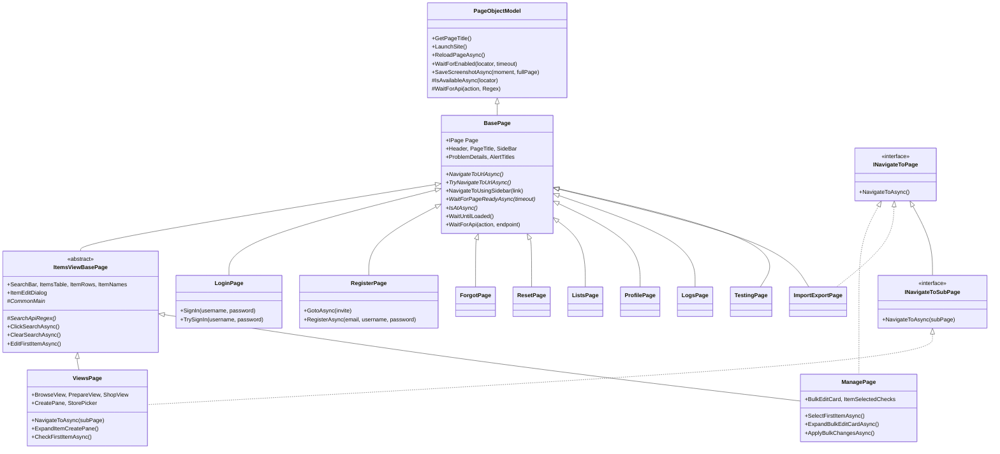

# Writing Page Object Models

Page objects are where all browser interaction lives. Step definitions decide *what* to do; page
objects know *how* — which element, how to wait for it, and when the operation is actually finished.

This is the layer that absorbs UI churn. When the front end changes, a well-built page object means
the fix is one line here and zero lines anywhere else.

See [architecture.md](./architecture.md) for how this layer fits the whole, and
[writing-steps.md](./writing-steps.md) for the callers.

## Contents

- [Design Principles](#design-principles)
- [Class Hierarchy](#class-hierarchy)
- [Page Class Anatomy](#page-class-anatomy)
- [Locator Conventions](#locator-conventions)
- [Navigation Methods](#navigation-methods)
- [Page Readiness](#page-readiness)
- [The WaitForApi Pattern](#the-waitforapi-pattern)
- [Components](#components)
- [Example Walkthrough](#example-walkthrough)
- [Checklist](#checklist)

## Design Principles

Three rules come from [`Pages/README.md`](../Pages/README.md) and are non-negotiable.

### 1. Exclusive use of locators

**Page objects are the only place a locator may be constructed.** No step class, no feature file,
no test fixture builds a selector. This gives one place to change when the UI changes.

In practice this means no step ever calls `context.Page.Locator(...)` or `GetByTestId(...)`. If a
step needs an element, the page object exposes a method — or, when the step genuinely needs to hold
an element across steps, an `ILocator` property.

### 2. Single locator definition

**Within a page object, a selector string appears exactly once.** Compose downward from a root
rather than repeating a prefix:

```csharp
public ILocator BulkEditCard => Main.Locator("form.card");
public ILocator BulkEditCardBody => BulkEditCard.Locator(".card-body");
public ILocator BulkStoreInput => BulkEditCardBody.Locator("#inputStore");
public ILocator BulkApplyButton => BulkEditCardBody.GetByTestId("SpinnerButton");
```

If `data-test-id="SpinnerButton"` is renamed on the client, one line changes here. If the bulk edit
card moves inside a different container, only `BulkEditCard` changes.

### 3. All waiting happens in page objects

**Steps never wait, sleep, or poll.** Load conditions are page-specific and change with the design,
so they belong next to the locators they depend on. A step method should read as a plain sequence of
intentions:

```csharp
[When("applying bulk changes")]
public async Task ApplyingBulkChanges()
{
    var pageModel = context.GetOrCreatePage<ManagePage>();
    await pageModel.ApplyBulkChangesAsync();
}
```

Every await inside `ApplyBulkChangesAsync` is the page object's problem.

### 4. Playwright belongs in page objects

Principles 1 and 3 have a single practical tell: **if a step definition is reaching for Playwright,
the logic is in the wrong layer.**

This is enforced structurally. [`GlobalUsings.cs`](../GlobalUsings.cs) exports only
`NUnit.Framework` — `Microsoft.Playwright` was **deliberately removed** from it, so that any file
naming a Playwright type must import it explicitly:

```csharp
using Microsoft.Playwright;   // in a step file, this line is asking to be justified
```

That single line turns an invisible layering violation into something that shows up in a diff. In
`Pages/` and `Components/` it is expected and appears in sixteen files. In `Steps/` it appears in
three — `BrowseSteps`, `ManageSteps`, `NavigationSteps` — and each one should be able to say why.

```csharp
// WRONG — the step knows the markup and does its own waiting
[When("user chooses Deselect All")]
public async Task UserChoosesDeselectAll()
{
    await context.Page.Locator("#manage-page").GetByTestId("DeselectAll").ClickAsync();
    await context.Page.WaitForTimeoutAsync(500);
}
```

```csharp
// RIGHT — the step states intent; ManagePage owns the locator and the settling
[When("user chooses Deselect All")]
public async Task UserChoosesDeselectAll()
{
    var pageModel = context.GetOrCreatePage<ManagePage>();
    await pageModel.DeselectAllAsync();
}
```

The wrong version duplicates `#manage-page`, hides a `DeselectAll` test-id outside the page object,
and buries an arbitrary timeout where nobody maintaining `ManagePage` will find it.

**The test:** would this line still make sense if the driver weren't Playwright? A step saying "the
user chooses Deselect All" survives that question. A step calling `ClickAsync()` does not.

#### The two sanctioned exceptions

A step may **hold** a Playwright value without **operating** on it:

| Type | Why it's allowed |
| --- | --- |
| `ILocator` | Carried across steps via the `ObjectStore` as an opaque handle. The page object still interprets it — see `ManagePage.ResolveSelectedCheckboxAsync`. |
| `IResponse` | Stored by navigation steps so `Then page loaded ok` can assert `response.Ok`. |

In both cases the step stores and retrieves the value and nothing more. The moment a step calls a
method on one, that call belongs in a page object.

#### The import is necessary but not sufficient

C# only requires a `using` to **name** a type. Calling a method on an `ILocator` handed back by a
page-object property needs no import at all, so this compiles cleanly in a file with no Playwright
using in sight:

```csharp
// SearchSteps.cs — no `using Microsoft.Playwright;`, but still driving the browser from a step
var pageModel = context.ObjectStore.Get<ItemsViewBasePage>();
await pageModel.SearchTerm.FillAsync(term);
await pageModel.ClickSearchAsync();
```

`FillAsync` on a raw locator is the page object's job — `ItemsViewBasePage` should expose an
`EnterSearchTermAsync(term)` that owns both the fill and the search click.

So pair the import check with a method-call sweep:

```powershell
Select-String -Path .\Steps\*.cs -Pattern 'ClickAsync|FillAsync|GetByTestId|WaitForAsync|\.Locator\('
```

Today that returns eight hits across `BrowseSteps`, `ItemSteps`, `ManageSteps`, `PasswordSteps`, and
`SearchSteps`. None of them construct a locator — each operates on one exposed by a page object — so
principle 1 holds, but principle 3 does not: the waiting and interaction escaped the page object.
Each hit is a page-object method waiting to be extracted. **Don't add a ninth.**

### 5. Wait for the operation to settle, not just for the API to respond

This is the rule that most often gets violated, and it produces exactly the flakiness that tempts
people to add `Task.Delay`.

An API response means the *server* is done. It does not mean the browser has re-rendered. When an
action triggers a command **and** a consequent refresh, await both, then confirm the page is ready
again. `ManagePage.ApplySelectionAsync` is the reference implementation:

```csharp
/// <summary>
/// Apply a server-scoped selection operation and wait for the refreshed
/// Manage results to finish rendering.
/// </summary>
private async Task ApplySelectionAsync(ILocator button)
{
    var selectionResponseTask = Page!.WaitForResponseAsync(response => ApiSelectionRegex().IsMatch(response.Url));
    var refreshResponseTask = Page.WaitForResponseAsync(response => ApiManageEndpoint().IsMatch(response.Url));

    await button.ClickAsync();

    var responses = await Task.WhenAll(selectionResponseTask, refreshResponseTask);
    Assert.That(responses, Is.All.Property(nameof(IResponse.Ok)).True);

    await WaitForPageReadyAsync();
}
```

Note the shape: register **both** response waiters *before* clicking, click once, await both, assert
both succeeded, then re-await page readiness. This removed an artificial delay that had been
papering over the race.

**If you find yourself adding a `Task.Delay` to make a test pass, you have found a missing wait
condition.** See [Legitimate uses of Task.Delay](#legitimate-uses-of-taskdelay) for the narrow
exceptions.

### 6. Prefer semantic test IDs over structural locator chains

`.First`, `.Last`, `.Nth(n)`, and DOM traversal like `.Locator("..")` couple the test to markup
structure. They work, but they break for reasons that have nothing to do with behaviour.

This exists in `ManagePage` and is honest about what it costs:

```csharp
public ILocator BulkStoreCheckbox => BulkEditCardBody.Locator("#inputStore").Locator("..").Locator("..").GetByRole(AriaRole.Checkbox);
```

Two levels of parent traversal to find a checkbox next to an input. It works today. It will break
the moment someone wraps that input in another `<div>`.

**When adding a new UI contract, add a `data-test-id` to the client instead.** Reach for structural
locators only when you cannot change the markup.

## Class Hierarchy



### What each level contributes

| Class | Lives in | Provides |
| --- | --- | --- |
| `PageObjectModel` | [base library](../../submodules/jcoliz.FunctionalTests/src/FunctionalTests/PageObjectModel.cs) | Site launch, screenshots, `WaitForEnabled`, the raw `WaitForApi`. App-agnostic. |
| `BasePage` | [`Pages/BasePage.cs`](../Pages/BasePage.cs) | This app's chrome: header, sidebar, problem-details viewer, alerts, spinner. Declares the navigation and readiness contract. |
| `ItemsViewBasePage` | [`Pages/ItemsViewBasePage.cs`](../Pages/ItemsViewBasePage.cs) | Everything shared by Browse and Manage: search bar, items table, edit dialog. Abstract. |
| Concrete pages | `Pages/*.cs` | One class per page, with that page's locators and actions. |

### Choosing a base class

- Displays the items table with a search bar → derive from `ItemsViewBasePage`.
- Any other page in the app → derive from `BasePage`.
- Never derive from `PageObjectModel` directly. You would lose the sidebar, header, and problem
  details, which almost every test eventually needs.

### The navigation interfaces

[`INavigateToPage`](../Pages/INavigateToPage.cs) marks a page reachable from the sidebar of any
logged-in page:

```csharp
public interface INavigateToPage
{
    IPage? Page { set; }
    Task NavigateToAsync();
}

public interface INavigateToSubPage : INavigateToPage
{
    Task NavigateToAsync(string subPage);
}
```

`NavigationSteps` constrains its generic helpers on these, so implementing the interface is what
makes a page usable from the generic in-app navigation steps:

```csharp
public async Task WhenUserNavigatesTo<T>() where T : PageObjectModel, INavigateToPage
```

Implement `INavigateToPage` only if there is genuinely a sidebar link. Pages reached by URL only —
`LoginPage`, `RegisterPage`, `ResetPage` — should not implement it.

## Page Class Anatomy

```csharp
using System.Text.RegularExpressions;
using ListsWebApp.Tests.Functional.Components;

namespace ListsWebApp.Tests.Functional.Pages;

public partial class ManagePage(IPage _page) : ItemsViewBasePage(_page), INavigateToPage
{
    #region Locators
    #endregion

    #region Base Class Implementation
    #endregion

    #region Navigation
    #endregion

    #region Page State
    #endregion

    #region Item Actions
    #endregion

    #region API Regex Patterns
    #endregion
}
```

### Rules

| Rule | Why |
| --- | --- |
| Primary constructor `(IPage _page)`, forwarded to the base | `GetOrCreatePage<T>()` constructs pages via `Activator.CreateInstance(typeof(T), Page)`. A different constructor shape fails at **runtime**, not compile time. |
| Declare the class `partial` | Required for `[GeneratedRegex]` source generation. Nearly every page needs it. |
| One file per page, named `{Page}Page.cs` | Predictability. |
| Underscore-prefixed `_page` parameter | Distinguishes the constructor parameter from the inherited `Page` property. |

### Why locators use `Page!`

`BasePage` re-exposes the page as a public property, because `PageObjectModel` keeps its constructor
parameter private:

```csharp
public IPage? Page { get; set; } = _page;
```

It is nullable to satisfy the `INavigateToPage.Page { set; }` contract, hence the `!` in every
locator. That is the established idiom — follow it rather than adding null checks.

### Region conventions

| Region | Contains |
| --- | --- |
| `Locators` | `ILocator` properties. Always first — it's what readers scan for. |
| `Base Class Implementation` | Overrides of abstract members, e.g. `CommonMain`, `SearchApiRegex()`. |
| `Navigation` | `NavigateToUrlAsync`, `TryNavigateToUrlAsync`, `NavigateToAsync`. |
| `Page State` | `WaitForPageReadyAsync`, `IsAtAsync`, and visibility predicates. |
| Feature regions | `Item Actions`, `Bulk Edit`, `Delete Confirmation Dialog` — group by UI area. |
| `API Regex Patterns` | `[GeneratedRegex]` partial methods. Always last. |

Small pages like [`ListsPage`](../Pages/ListsPage.cs) skip regions entirely. Don't add ceremony to a
40-line class.

## Locator Conventions

### Prefer `GetByTestId`

The client marks elements with `data-test-id`, and Playwright is configured to read it. This is the
contract between front end and tests:

```csharp
public ILocator SearchTerm => SearchBar.GetByTestId("SearchTerm");
public ILocator BulkApplyButton => BulkEditCardBody.GetByTestId("SpinnerButton");
public ILocator SelectAllButton => BulkEditCardBody.GetByTestId("SelectAll");
```

### Scope every locator to a root

Start from a page-level root and narrow. Never query the whole document for something that lives in
a known container:

```csharp
public ILocator Main => Page!.Locator("#manage-page");
public ILocator ItemSelectedChecks => ItemsTable.GetByTestId("Selected");
public ILocator AccessDenied => Main.GetByTestId("AccessDenied");
```

Scoping prevents a test-id that appears in two places from silently matching the wrong one, and
keeps `.First` from becoming necessary.

### Fallback order

Reach for these in order, and only fall down the list when the level above isn't available:

1. **`GetByTestId("Name")`** — the contract. Add one to the client if it's missing.
2. **`Locator("#element-id")`** — stable ids the app already guarantees, like `#SearchBar`,
   `#manage-page`, `#StorePicker`.
3. **`GetByRole(AriaRole.Button)`** — semantic and accessibility-aligned.
4. **CSS structure** — `Locator("tbody >> tr")`, `Locator(".card-body")`. Acceptable for generic
   structure like table rows.
5. **Parent traversal** — `Locator("..")`. Last resort; leave a comment explaining why.

### Parameterized locators

When an element is selected by a runtime value, expose a method rather than a property:

```csharp
public ILocator SideBarItem(string name) => SideBar.GetByTestId(name);
public ILocator Field(string name) => Form.Locator($"[name='{name}']");
```

### Exposing an `ILocator` to steps

Occasionally a step must hold an element across steps — "select the first item… later, confirm it's
still selected". That is the one sanctioned case for a step touching an `ILocator`, and the page
object still owns how to interpret it:

```csharp
/// <summary>
/// Given a locator that is either a row or a checkbox,
/// resolve the "Selected" checkbox locator
/// </summary>
public async Task<ILocator> ResolveSelectedCheckboxAsync(ILocator locator)
{
    var tagName = await locator.EvaluateAsync<string>("el => el.tagName");
    return tagName.Equals("TR", StringComparison.OrdinalIgnoreCase)
        ? locator.GetByTestId("Selected")
        : locator;
}
```

The step stores an opaque handle in the `ObjectStore` and hands it back later. It never interprets
the DOM itself.

## Navigation Methods

Four distinct methods, four distinct purposes. Getting these confused is a common source of
mysterious failures.

| Method | Mechanism | Waits for readiness? | Use when |
| --- | --- | --- | --- |
| `NavigateToUrlAsync()` | Browser address bar | **Yes** | Getting to a page directly, expecting success |
| `TryNavigateToUrlAsync()` | Browser address bar | **No** | Expecting redirect, 404, or access denial |
| `NavigateToAsync()` | Sidebar click | **Yes** | Exercising in-app navigation |
| `NavigateToAsync(string subPage)` | In-page nav bar | **Yes** | Sub-page within Browse |

### `NavigateToUrlAsync` — direct, verified

Override it, navigate, then **wait for readiness before returning**:

```csharp
public override async Task<IResponse?> NavigateToUrlAsync()
{
    var result = await Page!.GotoAsync("/manage");
    await WaitForPageReadyAsync();
    return result;
}
```

Returning the `IResponse` matters: `NavigationSteps` puts it in the `ObjectStore` so a later
`Then page loaded ok` can assert on it.

### `TryNavigateToUrlAsync` — direct, unverified

Identical navigation, no readiness wait, because the page may never appear:

```csharp
/// <summary>
/// Navigate to this page using the browser address bar, but don't confirm successful
/// </summary>
public override Task<IResponse?> TryNavigateToUrlAsync()
{
    return Page!.GotoAsync("/manage");
}
```

This backs `When user attempts to navigate to {name} page` — the step used for
redirect-when-logged-out and access-denied scenarios. Waiting for readiness there would hang until
timeout on a test that is *supposed* to fail to load.

**Implement both.** `TryNavigateToUrlAsync` holds the URL; `NavigateToUrlAsync` can then be written
in terms of it, as `ProfilePage` does:

```csharp
public async override Task<IResponse?> NavigateToUrlAsync()
{
    var result = await TryNavigateToUrlAsync();
    await WaitForPageReadyAsync();
    return result;
}
```

That's the preferred shape — the URL literal appears once.

### `NavigateToAsync` — via the sidebar

For `INavigateToPage` implementers. Click the sidebar link and wait for the page's data call:

```csharp
public async Task NavigateToAsync()
{
    await WaitForApi(async () =>
    {
        await NavigateToUsingSidebar("Manage");
    }, ApiManageEndpoint());
}
```

`NavigateToUsingSidebar` is inherited from `BasePage` — it clicks `SideBar.GetByTestId(link)`.

### `NavigateToAsync(string subPage)` — idempotent sub-navigation

`ViewsPage` hosts three sub-pages (Browse, Prepare, Shop). Its navigation checks where it already is
and only moves if needed, so calling it from a `Given` is cheap and safe:

```csharp
public async Task NavigateToAsync(string subPage)
{
    // If we're not already on the correct top-level page, get there
    var isAlreadyOnTopView = await Main.IsVisibleAsync();
    if (!isAlreadyOnTopView)
    {
        await WaitForApi(async () =>
        {
            await NavigateToUsingSidebar("Browse");
        }, EndpointForSubPage());
    }

    // If we're not already on the correct sub-page, get there
    if (!await IsOnSubPageAsync(subPage))
    {
        await NavigateToSubPageAsync(subPage);
    }
}
```

**Make navigation idempotent.** A scenario shouldn't fail because a `Given` navigated somewhere the
`Background` had already reached.

### Mapping page names to types

Steps take a page name string and switch on it, so a new page needs registering in the relevant
switch expressions in [`NavigationSteps`](../Steps/NavigationSteps.cs):

```csharp
BasePage model = name switch
{
    "Login" => context.GetOrCreatePage<LoginPage>(),
    "Manage" => context.GetOrCreatePage<ManagePage>(),
    // ...
    _ => throw new NotImplementedException($"Navigation to page '{name}' is not implemented.")
};
```

There are three of these — `UserNavigatesToAnyPage`, `UserAttemptsToNavigateToPage`, and
`NamedPageIsDisplayed`. Add your page to whichever ones apply.

## Page Readiness

`BasePage` declares three readiness members. All three throw `NotImplementedException` by default,
so an unimplemented one fails loudly rather than silently passing.

```csharp
public virtual Task WaitForPageReadyAsync(float timeout = 5000) => throw new NotImplementedException();
public virtual Task<bool> IsAtAsync() => throw new NotImplementedException();
public async Task WaitUntilLoaded() { /* waits for BaseSpinner to hide */ }
```

### `WaitForPageReadyAsync` — the important one

Wait for something that proves the page is **interactive**, not merely present. Visible-in-DOM is
not the same as hydrated: this is a Vue app, and elements render disabled before hydration
completes.

`WaitForEnabled` from `PageObjectModel` exists precisely for this — it waits for attached, then
visible, then polls until not-disabled:

```csharp
public async override Task WaitForPageReadyAsync(float timeout = 5000)
{
    await WaitForEnabled(SearchButton, timeout);
}
```

**Accept alternative outcomes with `.Or()`.** A page that may legitimately render access-denied or
an error must not hang for the full timeout in those cases:

```csharp
/// <summary>
/// Waits for the page to be ready by checking the search button is enabled,
/// or the access denied or problem details indicators are visible
/// </summary>
public override async Task WaitForPageReadyAsync(float timeout = 5000)
{
    await SearchButton.Or(AccessDenied).Or(ProblemDetails).WaitForAsync(
        new LocatorWaitForOptions() { State = WaitForSelectorState.Visible, Timeout = timeout });

    if (await SearchButton.IsVisibleAsync())
    {
        await WaitForEnabled(SearchButton, timeout);
    }
}
```

This is the pattern for any page used in both success and no-access scenarios.

**Wait for a spinner to disappear** when the page has an explicit loading indicator:

```csharp
public async override Task WaitForPageReadyAsync(float timeout = 5000)
{
    await IsLoading.WaitForAsync(new LocatorWaitForOptions() { State = WaitForSelectorState.Hidden, Timeout = timeout });
}
```

**Wait for state that lags the visual**, when correctness depends on it. `ProfilePage` waits for the
authentication icon as well as the logout button, because the button renders before auth state has
settled:

```csharp
public async override Task WaitForPageReadyAsync(float timeout = 5000)
{
    await WaitForEnabled(LogoutButton, timeout);

    // We need this to be 100% sure the login state has fully settled
    await StatusAuthenticatedIcon.WaitForAsync(new LocatorWaitForOptions() { State = WaitForSelectorState.Visible, Timeout = timeout });
}
```

Always keep the `float timeout = 5000` parameter and honour it — callers override it.

### `IsAtAsync` — a cheap assertion

Returns whether we are on this page. Unlike `WaitForPageReadyAsync` it must **not** wait; it answers
immediately about the current state, usually via the page's root element:

```csharp
public override Task<bool> IsAtAsync()
{
    return Main.IsVisibleAsync();
}
```

Steps pair them — wait, then assert:

```csharp
await pageModel.WaitForPageReadyAsync();
var isAt = await pageModel.IsAtAsync();
Assert.That(isAt, Is.True, $"Expected to be at {name} page, but was not.");
```

### `ReloadPageAsync` already waits

`BasePage` overrides it to reload *and* re-await readiness, so the `reloading the current page` step
needs nothing extra:

```csharp
public async override Task ReloadPageAsync()
{
    await Page!.ReloadAsync();
    await WaitForPageReadyAsync();
}
```

## The WaitForApi Pattern

Nearly every meaningful UI action triggers an HTTP call. Wrapping the action in `WaitForApi` binds
the click to its network round-trip, which is far more reliable than waiting for a DOM change that
might not be distinguishable from the pre-click state.

Under the hood it's `Page.RunAndWaitForResponseAsync`, which registers the response waiter *before*
running the action — closing the race where a fast response arrives before you start listening.

### Three overloads, and they differ

| Overload | Declared in | Asserts `response.Ok`? |
| --- | --- | --- |
| `WaitForApi(Func<Task>, string? endpoint = null)` | `BasePage` | **Yes** |
| `WaitForApi(Func<Task>, Regex)` | `BasePage` → `PageObjectModel` | **No** |
| `WaitForApi(Func<Task>, Regex)` (protected) | `PageObjectModel` | **No** |

The string overload defaults to the glob `/api/**` and asserts success. The regex overloads only
log. **If you use a regex and need the call to have succeeded, assert it yourself** — as
`ApplySelectionAsync` does.

### Usage

```csharp
public async Task ApplyBulkChangesAsync()
{
    await WaitForApi(async () =>
    {
        await BulkApplyButton.ClickAsync();
    }, ApiBulkEditRegex());
}
```

Keep the lambda to the single triggering interaction. Setup goes before it, follow-up waits after:

```csharp
public async Task SetStoreFilterAsync(string store)
{
    await FilterButton.ClickAsync();
    await ChooseStoreOption.WaitForAsync();

    await WaitForApi(async () =>
    {
        await ChooseStoreOption.ClickAsync();
    }, ApiStoresRegex());

    var storeOption = StoreListItems.GetByText(store, new() { Exact = true });
    await storeOption.WaitForAsync();

    await WaitForApi(async () =>
    {
        await storeOption.ClickAsync();
    }, ApiManageEndpoint());
}
```

Three interactions, two API waits, each scoped to the click that causes it.

### Writing the regex

Use `[GeneratedRegex]` partial methods — compile-time generation, no runtime parsing, and the
pattern sits in one place at the bottom of the file. Leave a comment showing a real URL:

```csharp
#region API Regex Patterns

// /api/tenant/{tenantKey}/Views/Manage?q=...&s=...
[GeneratedRegex("/api/tenant/[0-9a-fA-F]{8}-[0-9a-fA-F]{4}-[0-9a-fA-F]{4}-[0-9a-fA-F]{4}-[0-9a-fA-F]{12}/Views/Manage")]
private static partial Regex ApiManageEndpoint();

// /api/tenant/{tenantKey}/Items/{id}/Selected
[GeneratedRegex("/api/tenant/[0-9a-fA-F]{8}-[0-9a-fA-F]{4}-[0-9a-fA-F]{4}-[0-9a-fA-F]{4}-[0-9a-fA-F]{12}/Items/[0-9]+/Selected")]
private static partial Regex ApiSelectedRegex();

#endregion
```

Guidelines:

- **Match the tenant GUID, don't hardcode it.** The tenant differs per environment and per run. The
  literal `[0-9a-fA-F]{8}-[0-9a-fA-F]{4}-[0-9a-fA-F]{4}-[0-9a-fA-F]{4}-[0-9a-fA-F]{12}` is repeated
  throughout the `Pages/` folder — copy it verbatim so a future extraction can find them all.
- **Be specific enough to exclude siblings.** `ApiSearchRegex` appends `\?q=.*` so a search response
  isn't confused with a plain page load of the same endpoint.
- **Anchor with `$` when a shorter path would also match a longer one.** `Items$` for bulk delete,
  so it doesn't match `Items/42/Selected`.
- **Name for the operation, not the URL** — `ApiBulkDeleteRegex`, not `ApiItemsDeleteRegex`.
- Regexes are `private` unless a base class needs them. `ItemsViewBasePage.ApiItemsRegex()` is
  `protected` because derived pages share it.

### Supplying a regex to shared base behaviour

`ItemsViewBasePage` implements search once and defers the endpoint to each subclass:

```csharp
protected abstract Regex SearchApiRegex();

public async Task ClickSearchAsync()
{
    await WaitForApi(async () =>
    {
        await SearchButton.ClickAsync();
    }, SearchApiRegex());
}
```

```csharp
// In ManagePage
protected override Regex SearchApiRegex() => ApiSearchRegex();
```

Same for `CommonMain`, which scopes the shared items table to each page's own root. **When adding
behaviour shared by Browse and Manage, put it in `ItemsViewBasePage` and abstract out the
differences** rather than duplicating the method.

### Legitimate uses of `Task.Delay`

There are exactly two categories in the codebase, both documented in place:

**CSS transitions** — no network call and no reliable completion event:

```csharp
public async Task ExpandBulkEditCardAsync()
{
    await BulkEditToggleButton.ClickAsync();
    await BulkEditCardBody.WaitForAsync();

    // Wait for expand animation to complete
    await Task.Delay(TimeSpan.FromMilliseconds(400));
}
```

**Unknowable item counts** — waiting for "all" of something when the count isn't known:

```csharp
await StoreListItems.First.WaitForAsync();

// We want them *all* to be displayed, but we don't have a reliable way to know how many there will be, so we'll just wait a little bit here
await Task.Delay(TimeSpan.FromMilliseconds(100));
```

Note both wait for a real condition **first**, then add a small delay for the unobservable part.
A bare `Task.Delay` with no preceding wait is always a bug. Always comment why.

## Components

A component models a reusable UI element that isn't a page — a dialog, a shared input group. They
live in [`Components/`](../Components/) and compose into pages by holding a reference to their
parent rather than inheriting.

### Dialog component: parented to a page

[`ItemEditDialog`](../Components/ItemEditDialog.cs) takes the `BasePage` that hosts it, which gives
it access to both `Page` and the page's `WaitForApi`:

```csharp
public partial class ItemEditDialog(BasePage parent)
{
    public ILocator Root => parent.Page!.Locator("#ItemEditDialog");
    public ILocator Form => Root.GetByTestId("EditModal");
    public ILocator Name => Form.Locator("[name='Name']");
    public ILocator Submit => Root.Locator("[type='submit']");
    public ILocator CancelButton => Root.GetByTestId("CancelButton");

    /// <summary>
    /// Returns a locator for a named input field within the edit form
    /// </summary>
    public ILocator Field(string name) => Form.Locator($"[name='{name}']");

    public async Task CloseAsync() => await CancelButton.ClickAsync();

    public async Task SaveAsync()
    {
        await parent.WaitForApi(async () =>
        {
            await Submit.ClickAsync();
        }, ApiItemsRegex());
    }

    [GeneratedRegex("/api/tenant/[0-9a-fA-F]{8}-[0-9a-fA-F]{4}-[0-9a-fA-F]{4}-[0-9a-fA-F]{4}-[0-9a-fA-F]{12}/Items/[0-9]+")]
    private static partial Regex ApiItemsRegex();
}
```

The page exposes it as a property:

```csharp
public ItemEditDialog ItemEditDialog => new(this);
```

Because it's a fresh instance each access and holds only locators — which are lazy in Playwright —
this is cheap and always current. **Components must not cache element handles.**

### Locator component: parented to a locator

[`BaseInputTextIdentity`](../Components/BaseInputTextIdentity.cs) is thinner — it encapsulates the
mapping from a semantic field name to the identity library's element ids:

```csharp
public class BaseInputTextIdentity(ILocator parent, string kind)
{
    public ILocator Locator => kind switch
    {
        "email" => parent.Locator("#floatingInput"),
        "password" => parent.Locator("#floatingPassword"),
        "username" => parent.Locator("#floatingUsername"),
        _ => throw new NotImplementedException()
    };
}
```

Used by every identity page, so the ids are defined once:

```csharp
public ILocator EmailInput => new BaseInputTextIdentity(View, "email").Locator;
public ILocator UsernameInput => new BaseInputTextIdentity(View, "username").Locator;
public ILocator PasswordInput => new BaseInputTextIdentity(View, "password").Locator;
```

### When to extract a component

Extract when the element appears on **two or more pages**, or when it's a self-contained modal with
its own actions. A section that only ever appears on one page — the Manage bulk edit card — stays as
a region in that page class.

| Parent type | Use when |
| --- | --- |
| `BasePage parent` | The component needs `WaitForApi` or page-level context. Dialogs. |
| `ILocator parent` | The component is a pure locator mapping scoped to a container. |

## Example Walkthrough

Adding a page object for a hypothetical Favorites page at `/favorites`, reachable from the sidebar
and showing a filterable list.

### 1. Confirm the client's test IDs

Before writing anything, check what the front end exposes. If the elements you need have no
`data-test-id`, **add them to the client first**. Structural locators written now become
maintenance debt later.

Assume: root `#favorites-page`, sidebar link `data-test-id="Favorites"`, a spinner
`data-test-id="IsLoading"`, a list `data-test-id="FavoritesList"`, and a per-row remove button
`data-test-id="Remove"`.

### 2. Pick the base class

No search bar and no items table, so `BasePage`. It's reachable from the sidebar, so implement
`INavigateToPage`.

### 3. Create the class

```csharp
using System.Text.RegularExpressions;

namespace ListsWebApp.Tests.Functional.Pages;

public partial class FavoritesPage(IPage _page) : BasePage(_page), INavigateToPage
{
    #region Locators

    public ILocator Main => Page!.Locator("#favorites-page");
    public ILocator IsLoading => Main.GetByTestId("IsLoading");
    public ILocator FavoritesList => Main.GetByTestId("FavoritesList");
    public ILocator FavoriteRows => FavoritesList.Locator("li");
    public ILocator AccessDenied => Main.GetByTestId("AccessDenied");

    #endregion
}
```

Every locator descends from `Main`. One selector string each.

### 4. Implement navigation

```csharp
#region Navigation

/// <summary>
/// Navigate to this page from any logged-in page using the sidebar
/// </summary>
public async Task NavigateToAsync()
{
    await WaitForApi(async () =>
    {
        await NavigateToUsingSidebar("Favorites");
    }, ApiFavoritesRegex());
}

public async override Task<IResponse?> NavigateToUrlAsync()
{
    var result = await TryNavigateToUrlAsync();
    await WaitForPageReadyAsync();
    return result;
}

public override Task<IResponse?> TryNavigateToUrlAsync()
{
    return Page!.GotoAsync("/favorites");
}

#endregion
```

The URL appears once, in `TryNavigateToUrlAsync`.

### 5. Implement readiness

The page can render access-denied, so accept either outcome:

```csharp
#region Page State

/// <summary>
/// Waits for the page to be ready: either the list has finished loading,
/// or the access denied indicator is visible.
/// </summary>
public override async Task WaitForPageReadyAsync(float timeout = 5000)
{
    await FavoritesList.Or(AccessDenied).Or(ProblemDetails).WaitForAsync(
        new LocatorWaitForOptions() { State = WaitForSelectorState.Visible, Timeout = timeout });

    if (await FavoritesList.IsVisibleAsync())
    {
        await IsLoading.WaitForAsync(
            new LocatorWaitForOptions() { State = WaitForSelectorState.Hidden, Timeout = timeout });
    }
}

public override Task<bool> IsAtAsync() => Main.IsVisibleAsync();

#endregion
```

### 6. Add actions — and settle them properly

Removing a favorite fires a DELETE *and* refreshes the list. Await both, then confirm the page is
ready again:

```csharp
#region Actions

/// <summary>
/// Remove the first favorite, waiting for both the delete command and
/// the resulting list refresh to complete.
/// </summary>
public async Task RemoveFirstFavoriteAsync()
{
    var removeTask = Page!.WaitForResponseAsync(r => ApiRemoveFavoriteRegex().IsMatch(r.Url));
    var refreshTask = Page.WaitForResponseAsync(r => ApiFavoritesRegex().IsMatch(r.Url));

    await FavoriteRows.First.GetByTestId("Remove").ClickAsync();

    var responses = await Task.WhenAll(removeTask, refreshTask);
    Assert.That(responses, Is.All.Property(nameof(IResponse.Ok)).True);

    await WaitForPageReadyAsync();
}

public Task<IReadOnlyList<string>> GetFavoriteNamesAsync()
    => FavoriteRows.AllInnerTextsAsync();

#endregion
```

Note `GetFavoriteNamesAsync` returns raw data and asserts nothing — assertions belong in the step.

### 7. Add the regexes

```csharp
#region API Regex Patterns

// /api/tenant/{tenantKey}/Favorites
[GeneratedRegex("/api/tenant/[0-9a-fA-F]{8}-[0-9a-fA-F]{4}-[0-9a-fA-F]{4}-[0-9a-fA-F]{4}-[0-9a-fA-F]{12}/Favorites$")]
private static partial Regex ApiFavoritesRegex();

// /api/tenant/{tenantKey}/Favorites/{id}
[GeneratedRegex("/api/tenant/[0-9a-fA-F]{8}-[0-9a-fA-F]{4}-[0-9a-fA-F]{4}-[0-9a-fA-F]{4}-[0-9a-fA-F]{12}/Favorites/[0-9]+")]
private static partial Regex ApiRemoveFavoriteRegex();

#endregion
```

The `$` anchor on `ApiFavoritesRegex` is what stops the list-refresh waiter from matching the delete
call.

### 8. Register the page with the navigation steps

Add `"Favorites" => context.GetOrCreatePage<FavoritesPage>(),` to the switch expressions in
[`NavigationSteps`](../Steps/NavigationSteps.cs) that apply — at minimum `UserNavigatesToAnyPage`
and `NamedPageIsDisplayed`.

### 9. Write the steps

Thin, as always — see [writing-steps.md](./writing-steps.md):

```csharp
[When("user removes the first favorite")]
public async Task UserRemovesTheFirstFavorite()
{
    var pageModel = context.GetOrCreatePage<FavoritesPage>();
    await pageModel.RemoveFirstFavoriteAsync();
}

[Then("the favorites list is empty")]
public async Task TheFavoritesListIsEmpty()
{
    var pageModel = context.GetOrCreatePage<FavoritesPage>();
    var names = await pageModel.GetFavoriteNamesAsync();

    Assert.That(names, Is.Empty, "Expected no favorites to remain in the list.");
}
```

## Checklist

Before committing a new or changed page object:

- [ ] Primary constructor is `(IPage _page)` forwarded to the base class
- [ ] Class is `partial` if it uses `[GeneratedRegex]`
- [ ] Derives from `ItemsViewBasePage` if it has the search bar + items table; otherwise `BasePage`
- [ ] Implements `INavigateToPage` only if genuinely reachable from the sidebar
- [ ] Every locator descends from a page root; no unscoped document queries
- [ ] Each selector string appears exactly once in the file
- [ ] `GetByTestId` used wherever the client provides one; new test IDs added to the client rather than working around their absence
- [ ] `.First` / `.Nth` / `.Locator("..")` avoided, or commented where unavoidable
- [ ] `NavigateToUrlAsync` waits for readiness; `TryNavigateToUrlAsync` does not
- [ ] URL literal appears once, in `TryNavigateToUrlAsync`
- [ ] `WaitForPageReadyAsync` waits for *interactive*, not merely visible, and honours its `timeout`
- [ ] `.Or()` used if the page can legitimately render access-denied or an error
- [ ] `IsAtAsync` returns immediately without waiting
- [ ] Every action that triggers an API call is wrapped in `WaitForApi`, or awaits the responses explicitly
- [ ] Actions that trigger a command *and* a refresh await both, then re-await readiness
- [ ] Regexes use `[GeneratedRegex]`, match the tenant GUID generically, and carry an example-URL comment
- [ ] No `Task.Delay` except after a real wait, for an animation or unknowable count, with a comment
- [ ] Query methods return data; assertions left to the step
- [ ] New page registered in the relevant `NavigationSteps` switch expressions

## See Also

- [architecture.md](./architecture.md) — how this layer fits the system
- [writing-steps.md](./writing-steps.md) — the callers of page objects
- [writing-features.md](./writing-features.md) — the Gherkin that drives it all
- [`Steps/`](../Steps/) — steps already available
- [`Pages/README.md`](../Pages/README.md) — the original three design rules
